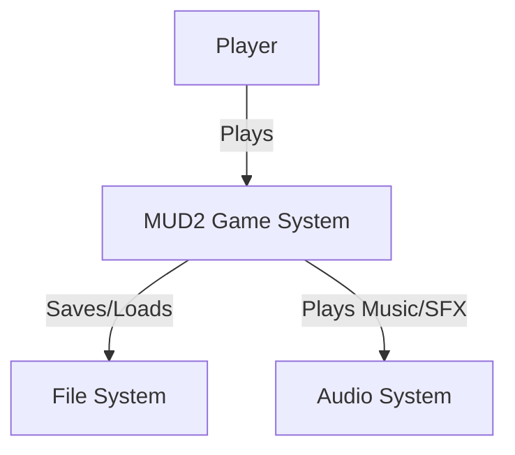
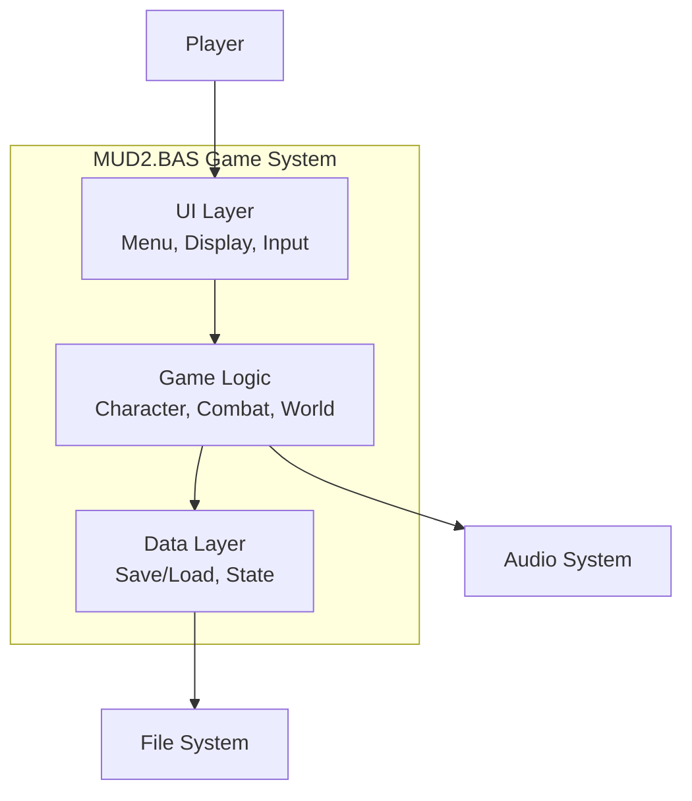
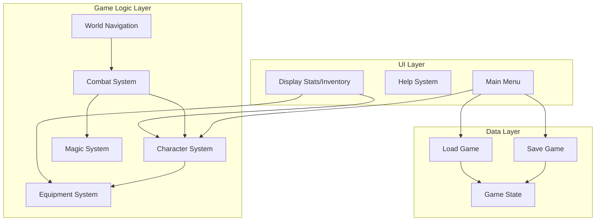

# MUD2.BAS - C4 Architecture Diagram

This is a C4-style architecture diagram showing the system context, containers, and components.

## Level 1: System Context

## Level 2: Container Diagram

## Level 3: Component Diagram

## Architecture Patterns

### Layered Architecture
- **Presentation Layer**: UI, menus, display functions
- **Business Logic Layer**: Game mechanics, combat, character management
- **Data Layer**: Save/load, state management

### Key Design Patterns
- **State Machine**: Game flow controlled by line labels and GOTO
- **Modular Subroutines**: Functionality separated into SUBs and FUNCTIONs
- **Shared State**: Global variables (DIM SHARED) for game state

