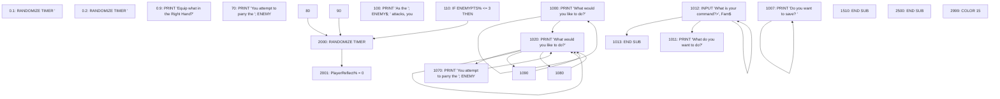

# MUD2.BAS - Battle System

```mermaid
flowchart TD
    L0_1["0.1: RANDOMIZE TIMER                        '"]
    L0_2["0.2: RANDOMIZE TIMER                        '"]
    L0_9["0.9: PRINT 'Equip what in the Right Hand?'"]
    L70["70: PRINT 'You attempt to parry the '; ENEMY"]
    L80["80"]
    L90["90"]
    L100["100: PRINT 'As the '; ENEMY$; ' attacks, you "]
    L110["110: IF ENEMYPTS% <= 3 THEN"]
    L1000["1000: PRINT 'What would you like to do?'"]
    L1007["1007: PRINT 'Do you want to save? <Y/N>'"]
    L1011["1011: PRINT 'What do you want to do?'"]
    L1012["1012: INPUT 'What is your command?>', Fam$"]
    L1013["1013: END SUB"]
    L1020["1020: PRINT 'What would you like to do?'"]
    L1070["1070: PRINT 'You attempt to parry the '; ENEMY"]
    L1080["1080"]
    L1090["1090"]
    L1510["1510: END SUB"]
    L2000["2000: RANDOMIZE TIMER"]
    L2001["2001: PlayerReflect% = 0"]
    L2500["2500: END SUB"]
    L2999["2999: COLOR 15"]

    L2000 --> L2001
    L1000 --> L1000
    L1000 --> L1020
    L1007 --> L1007
    L1012 --> L1013
    L1012 --> L1011
    L1012 --> L1012
    L1020 --> L1070
    L1020 --> L1020
    L1020 --> L1090
    L1020 --> L1080
    L1070 --> L1020
    L1080 --> L1020
    L1090 --> L1020
    L80 --> L2000
    L90 --> L2000
    L110 --> L2000
```

**Statistics:**
- Nodes (Line Labels): 22
- Edges (GOTO connections): 17
