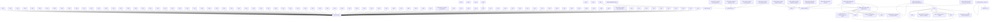

# MUD2.BAS - Boss Battles & Magic System

```mermaid
flowchart TD
    L3000["3000: END SUB"]
    L3001["3001"]
    L3002["3002"]
    L3003["3003"]
    L3004["3004"]
    L3005["3005"]
    L3006["3006"]
    L3007["3007"]
    L3008["3008"]
    L3009["3009"]
    L3010["3010"]
    L3011["3011"]
    L3012["3012"]
    L3013["3013"]
    L3014["3014"]
    L3015["3015"]
    L3016["3016"]
    L3017["3017"]
    L3018["3018"]
    L3019["3019"]
    L3020["3020"]
    L3021["3021"]
    L3022["3022"]
    L3023["3023"]
    L3024["3024"]
    L3025["3025"]
    L3026["3026"]
    L3027["3027"]
    L3028["3028"]
    L3029["3029"]
    L3030["3030"]
    L3031["3031"]
    L3032["3032"]
    L3033["3033"]
    L3034["3034"]
    L3035["3035"]
    L3036["3036"]
    L3037["3037"]
    L3038["3038"]
    L3039["3039"]
    L3040["3040"]
    L3041["3041"]
    L3042["3042"]
    L3043["3043"]
    L3044["3044"]
    L3045["3045"]
    L3046["3046"]
    L3047["3047"]
    L3048["3048"]
    L3049["3049"]
    L3050["3050"]
    L3051["3051"]
    L3052["3052"]
    L3053["3053"]
    L3054["3054"]
    L3055["3055"]
    L3056["3056"]
    L3057["3057"]
    L3058["3058"]
    L3059["3059"]
    L3060["3060"]
    L3061["3061"]
    L3062["3062: PRINT 'You freeze your opponent!'"]
    L3063["3063"]
    L3064["3064"]
    L3065["3065"]
    L3066["3066"]
    L3067["3067"]
    L3068["3068"]
    L3069["3069"]
    L3070["3070"]
    L3071["3071"]
    L3072["3072"]
    L3073["3073"]
    L3074["3074"]
    L3075["3075"]
    L3076["3076"]
    L3077["3077"]
    L3078["3078"]
    L3079["3079"]
    L3080["3080"]
    L3081["3081"]
    L3082["3082"]
    L3083["3083"]
    L3084["3084"]
    L3085["3085"]
    L3086["3086"]
    L3087["3087"]
    L3088["3088"]
    L3089["3089"]
    L3090["3090: PRINT 'Lightning never strikes twice!'"]
    L3091["3091"]
    L3092["3092"]
    L3093["3093"]
    L3094["3094"]
    L3095["3095"]
    L3096["3096"]
    L3097["3097"]
    L3098["3098"]
    L3099["3099"]
    L3100["3100"]
    L3500["3500: IF StunTime% = 0 THEN XanathusFleeTime% "]
    L3600["3600"]
    L3700["3700: PRINT 'You attempt to parry Xanathus' bl"]
    L3800["3800"]
    L3900["3900"]
    L3950["3950: PRINT 'As Xanathus attacks, you attempt "]
    L3975["3975: IF XanathusHP% <= 3 THEN"]
    L3976["3976: PRINT 'Xanathus casts a spell of curing "]
    L3977["3977: PRINT 'Xanathus casts magic arrow!'"]
    L3978["3978: PRINT 'Xanathus casts Hand of Dust!'"]
    L3979["3979: PRINT 'Xanathus prepares to flee!'"]
    L3980["3980: RANDOMIZE TIMER"]
    L3989["3989: 'Miscasts"]
    L3990["3990: END SUB"]
    L35000["35000: PRINT 'What would you like to do?'"]
    L36000["36000: PRINT 'What would you like to do?'"]
    L37000["37000: PRINT 'You attempt to parry Necrotalia's"]
    L38000["38000"]
    L39000["39000"]
    L39500["39500: PRINT 'As Necrotalia attacks, you attemp"]
    L39750["39750: IF NecrotaliaHP% <= 30 THEN"]
    L39760["39760: PRINT 'Necrotalia stands there and laugh"]
    L39770["39770: PRINT 'Necrotalia casts fire'"]
    L39780["39780: PRINT 'Necrotalia casts Gaze of Death!'"]
    L39790["39790: PRINT 'Necrotalia jumps forward and slas"]
    L39800["39800: PRINT 'Necrotalia casts hand of dust!'"]
    L39890["39890"]
    L39900["39900: END SUB"]
    L1000000["1000000: CLS"]
    L1000005["1000005: INPUT '>', Necro$"]

    L35000 --> L35000
    L35000 --> L36000
    L36000 --> L35000
    L36000 --> L36000
    L36000 --> L37000
    L36000 --> L39000
    L36000 --> L38000
    L36000 --> L39500
    L36000 --> L39750
    L37000 --> L36000
    L38000 --> L36000
    L39000 --> L36000
    L39500 --> L36000
    L39760 --> L39900
    L39770 --> L39890
    L39770 --> L39900
    L39780 --> L39890
    L39780 --> L39900
    L39790 --> L39900
    L39800 --> L39890
    L39800 --> L39900
    L1000005 --> L1000000
    L1000005 --> L1000005
    L3001 --> L3000
    L3002 --> L3000
    L3003 --> L3000
    L3004 --> L3000
    L3005 --> L3000
    L3006 --> L3000
    L3007 --> L3000
    L3008 --> L3000
    L3009 --> L3000
    L3010 --> L3000
    L3011 --> L3000
    L3012 --> L3000
    L3013 --> L3000
    L3014 --> L3000
    L3015 --> L3000
    L3016 --> L3000
    L3017 --> L3000
    L3018 --> L3000
    L3019 --> L3000
    L3020 --> L3000
    L3021 --> L3000
    L3022 --> L3000
    L3023 --> L3000
    L3024 --> L3000
    L3025 --> L3000
    L3026 --> L3000
    L3027 --> L3000
    L3028 --> L3000
    L3029 --> L3000
    L3030 --> L3000
    L3031 --> L3000
    L3032 --> L3000
    L3033 --> L3000
    L3034 --> L3000
    L3035 --> L3000
    L3036 --> L3000
    L3037 --> L3000
    L3039 --> L3000
    L3040 --> L3000
    L3041 --> L3000
    L3042 --> L3000
    L3043 --> L3000
    L3044 --> L3000
    L3045 --> L3000
    L3046 --> L3000
    L3047 --> L3000
    L3048 --> L3000
    L3049 --> L3000
    L3050 --> L3000
    L3051 --> L3000
    L3052 --> L3000
    L3053 --> L3000
    L3055 --> L3000
    L3056 --> L3000
    L3057 --> L3000
    L3058 --> L3000
    L3059 --> L3000
    L3060 --> L3000
    L3061 --> L3000
    L3062 --> L3000
    L3063 --> L3000
    L3064 --> L3000
    L3065 --> L3000
    L3066 --> L3000
    L3068 --> L3069
    L3069 --> L3000
    L3071 --> L3000
    L3072 --> L3000
    L3073 --> L3000
    L3074 --> L3000
    L3075 --> L3000
    L3076 --> L3000
    L3077 --> L3000
    L3079 --> L3000
    L3080 --> L3000
    L3082 --> L3000
    L3083 --> L3000
    L3084 --> L3000
    L3085 --> L3000
    L3086 --> L3000
    L3087 --> L3000
    L3088 --> L3000
    L3089 --> L3000
    L3090 --> L3000
    L3091 --> L3000
    L3092 --> L3000
    L3093 --> L3000
    L3094 --> L3000
    L3095 --> L3000
    L3096 --> L3000
    L3097 --> L3000
    L3098 --> L3000
    L3099 --> L3000
    L3100 --> L3000
    L3500 --> L3600
    L3500 --> L3500
    L3600 --> L3700
    L3600 --> L3800
    L3600 --> L3950
    L3600 --> L3600
    L3600 --> L3975
    L3600 --> L3900
    L3700 --> L3600
    L3800 --> L3600
    L3900 --> L3600
    L3950 --> L3600
    L3976 --> L3990
    L3977 --> L3990
    L3978 --> L3990
    L3978 --> L3989
    L3979 --> L3990
    L3980 --> L3990
    L3980 --> L3989
```

**Statistics:**
- Nodes (Line Labels): 131
- Edges (GOTO connections): 136
