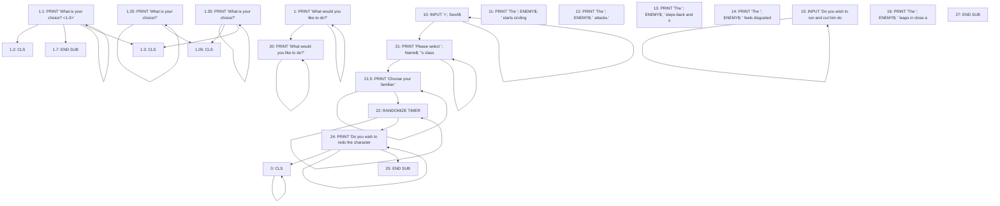

# MUD2.BAS - Character Creation Flow

```mermaid
flowchart TD
    L0["0: CLS"]
    L1["1: PRINT 'What would you like to do?'"]
    L1_05["1.05: CLS"]
    L1_1["1.1: PRINT 'What is your choice? <1-3>'"]
    L1_2["1.2: CLS"]
    L1_25["1.25: PRINT 'What is your choice?'"]
    L1_3["1.3: CLS"]
    L1_35["1.35: PRINT 'What is your choice?'"]
    L1_7["1.7: END SUB"]
    L10["10: INPUT '>', SexA$"]
    L11["11: PRINT 'The '; ENEMY$; ' starts circling "]
    L12["12: PRINT 'The '; ENEMY$; ' attacks.'"]
    L13["13: PRINT 'The '; ENEMY$; ' steps back and s"]
    L14["14: PRINT 'The '; ENEMY$; ' feels disgusted "]
    L15["15: INPUT 'Do you wish to run and cut him do"]
    L16["16: PRINT 'The '; ENEMY$; ' leaps in close a"]
    L20["20: PRINT 'What would you like to do?'"]
    L21["21: PRINT 'Please select '; Name$; ''s class"]
    L21_5["21.5: PRINT 'Choose your familiar:'"]
    L22["22: RANDOMIZE TIMER"]
    L24["24: PRINT 'Do you wish to redo the character"]
    L25["25: END SUB"]
    L27["27: END SUB"]

    L0 --> L0
    L1 --> L20
    L1 --> L1
    L1_1 --> L1_2
    L1_1 --> L1_7
    L1_1 --> L1_1
    L1_1 --> L1_3
    L1_25 --> L1_25
    L1_25 --> L1_05
    L1_35 --> L1_35
    L1_35 --> L1_05
    L1_35 --> L1_3
    L10 --> L21
    L10 --> L10
    L15 --> L15
    L20 --> L20
    L21 --> L21_5
    L21 --> L21
    L21_5 --> L21_5
    L21_5 --> L22
    L22 --> L22
    L22 --> L24
    L24 --> L0
    L24 --> L24
    L24 --> L25
```

**Statistics:**
- Nodes (Line Labels): 23
- Edges (GOTO connections): 25
