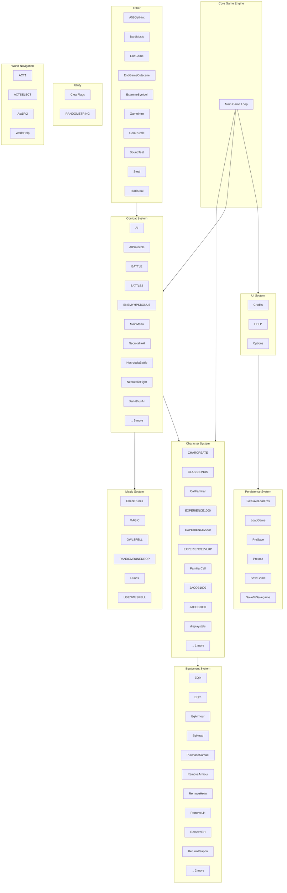

# MUD2.BAS - Component Architecture Diagram

This diagram shows the modular architecture of MUD2.BAS, organized by functional subsystems.

## Architecture Overview

## Component Details

### Character System

**Total Components**: 11

**Subroutines (11)**:
- `CHARCREATE`
- `CLASSBONUS`
- `CallFamiliar`
- `EXPERIENCE1000`
- `EXPERIENCE2000`
- `EXPERIENCELVLUP`
- `FamiliarCall`
- `JACOB1000`
- `JACOB2000`
- `displaystats`
- `jacobstats`

### Combat System

**Total Components**: 15

**Subroutines (14)**:
- `AI`
- `AIProtocols`
- `BATTLE`
- `BATTLE2`
- `MainMenu`
- `NecrotaliaAI`
- `NecrotaliaBattle`
- `NecrotaliaFight`
- `XanathusAI`
- `XanathusBattle`
- `XanathusFlee`
- `XanathusTaunt`
- `XanathusWorldFlee`
- `combat`

**Functions (1)**:
- `ENEMYHPSBONUS`

### Equipment System

**Total Components**: 12

**Subroutines (12)**:
- `EQlh`
- `EQrh`
- `EqArmour`
- `EqHead`
- `PurchaseSamael`
- `RemoveArmour`
- `RemoveHelm`
- `RemoveLH`
- `RemoveRH`
- `ReturnWeapon`
- `displayequip`
- `displayinventory`

### Magic System

**Total Components**: 6

**Subroutines (6)**:
- `CheckRunes`
- `MAGIC`
- `OWLSPELL`
- `RANDOMRUNEDROP`
- `Runes`
- `USEOWLSPELL`

### Other

**Total Components**: 10

**Subroutines (10)**:
- `A56GetHint`
- `BardMusic`
- `EndGame`
- `EndGameCutscene`
- `ExamineSymbol`
- `GameIntro`
- `GemPuzzle`
- `SoundTest`
- `Steal`
- `ToadSteal`

### Persistence System

**Total Components**: 6

**Subroutines (6)**:
- `GetSaveLoadPos`
- `LoadGame`
- `PreSave`
- `Preload`
- `SaveGame`
- `SaveToSavegame`

### UI System

**Total Components**: 3

**Subroutines (3)**:
- `Credits`
- `HELP`
- `Options`

### Utility

**Total Components**: 2

**Subroutines (2)**:
- `ClearFlags`
- `RANDOMSTRING`

### World Navigation

**Total Components**: 4

**Subroutines (4)**:
- `ACT1`
- `ACTSELECT`
- `Act1Pt2`
- `WorldHelp`

