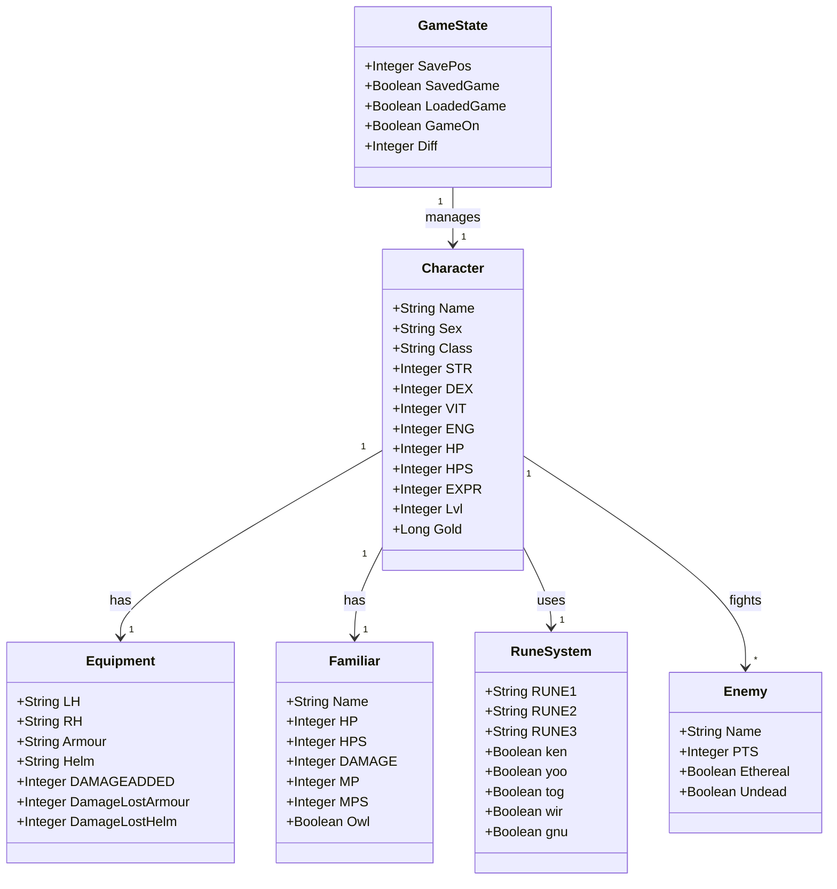

# MUD2.BAS - Data Model Diagram

This diagram shows the main data structures and their relationships.

## Data Structure Details

### Character
Core player attributes including stats, class, and progression.

### Equipment
Player's equipped items and their effects on combat.

### Familiar
Companion creature with its own stats and abilities.

### Enemy
Opponent data including special properties (ethereal, undead).

### GameState
Overall game state including save/load status and difficulty.

### RuneSystem
Magic rune collection and combinations for spells.

