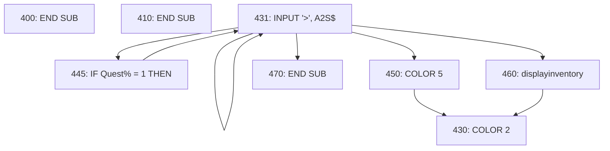

# MUD2.BAS - Equipment & Shop System

```mermaid
flowchart TD
    L400["400: END SUB"]
    L410["410: END SUB"]
    L430["430: COLOR 2"]
    L431["431: INPUT '>', A2S$"]
    L445["445: IF Quest% = 1 THEN"]
    L450["450: COLOR 5"]
    L460["460: displayinventory"]
    L470["470: END SUB"]

    L431 --> L431
    L431 --> L445
    L431 --> L470
    L431 --> L450
    L431 --> L460
    L445 --> L431
    L450 --> L430
    L460 --> L430
```

**Statistics:**
- Nodes (Line Labels): 8
- Edges (GOTO connections): 8
