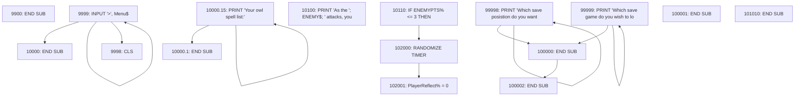

# MUD2.BAS - Main Menu & Save/Load System

```mermaid
flowchart TD
    L9900["9900: END SUB"]
    L9998["9998: CLS"]
    L9999["9999: INPUT '>', Menu$"]
    L10000["10000: END SUB"]
    L10000_1["10000.1: END SUB"]
    L10000_15["10000.15: PRINT 'Your owl spell list:'"]
    L10100["10100: PRINT 'As the '; ENEMY$; ' attacks, you "]
    L10110["10110: IF ENEMYPTS% <= 3 THEN"]
    L99998["99998: PRINT 'Which save posistion do you want "]
    L99999["99999: PRINT 'Which save game do you wish to lo"]
    L100000["100000: END SUB"]
    L100001["100001: END SUB"]
    L100002["100002: END SUB"]
    L101010["101010: END SUB"]
    L102000["102000: RANDOMIZE TIMER"]
    L102001["102001: PlayerReflect% = 0"]

    L9999 --> L10000
    L9999 --> L9999
    L9999 --> L9998
    L10000_15 --> L10000_1
    L10000_15 --> L10000_15
    L10110 --> L102000
    L99998 --> L100000
    L99998 --> L99998
    L99999 --> L100000
    L99999 --> L99999
    L100000 --> L100002
    L102000 --> L102001
```

**Statistics:**
- Nodes (Line Labels): 16
- Edges (GOTO connections): 12
