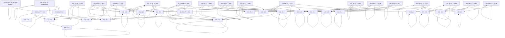

# MUD2.BAS - Act 1: Encampment & Labyrinth Level 1

```mermaid
flowchart TD
    L209["209: CLS"]
    L210["210: INPUT '>', A$"]
    L215["215: PRINT 'Do you wish to save <Y/N>?'"]
    L220["220: CLS"]
    L225["225: INPUT '>', A0$"]
    L230["230: CLS"]
    L235["235: COLOR 15"]
    L236["236: INPUT '>', SirJacobA1$"]
    L240["240: CLS"]
    L241["241: CLS"]
    L245["245: INPUT '>', A1$"]
    L250["250: CLS"]
    L255["255: INPUT '>', A2$"]
    L260["260: CLS"]
    L265["265: INPUT '>', A4$"]
    L270["270: CLS"]
    L275["275: INPUT '>', A5$"]
    L280["280: CLS"]
    L285["285: INPUT '>', A6$"]
    L290["290: CLS"]
    L295["295: INPUT '>', A3$"]
    L300["300: CLS"]
    L305["305: INPUT '>', A8$"]
    L310["310: CLS"]
    L315["315: INPUT '>', A7$"]
    L320["320: CLS"]
    L325["325: INPUT '>', A9$"]
    L330["330: CLS"]
    L335["335: INPUT '>', A10$"]
    L340["340: CLS"]
    L345["345: INPUT '>', A11$"]
    L350["350: CLS"]
    L355["355: INPUT '>', A12$"]
    L360["360: CLS"]
    L365["365: INPUT '>', A13$"]
    L370["370: CLS"]
    L375["375: INPUT '>', A14$"]
    L380["380: CLS"]
    L385["385: INPUT '>', A15$"]
    L390["390: CLS"]
    L395["395: INPUT '>', A16$"]

    L210 --> L210
    L210 --> L209
    L210 --> L240
    L210 --> L220
    L215 --> L210
    L215 --> L215
    L225 --> L225
    L225 --> L230
    L225 --> L220
    L235 --> L240
    L235 --> L220
    L236 --> L210
    L236 --> L235
    L236 --> L230
    L236 --> L236
    L240 --> L241
    L241 --> L241
    L245 --> L241
    L245 --> L250
    L245 --> L245
    L245 --> L230
    L250 --> L250
    L255 --> L240
    L255 --> L255
    L255 --> L225
    L255 --> L260
    L255 --> L250
    L255 --> L270
    L260 --> L260
    L265 --> L290
    L265 --> L300
    L265 --> L265
    L265 --> L260
    L265 --> L250
    L265 --> L270
    L270 --> L270
    L275 --> L275
    L275 --> L310
    L275 --> L260
    L275 --> L225
    L275 --> L280
    L275 --> L250
    L275 --> L270
    L280 --> L270
    L285 --> L280
    L285 --> L270
    L285 --> L320
    L285 --> L285
    L290 --> L290
    L295 --> L260
    L295 --> L290
    L295 --> L295
    L300 --> L300
    L305 --> L310
    L305 --> L300
    L305 --> L260
    L305 --> L330
    L305 --> L305
    L310 --> L310
    L315 --> L310
    L315 --> L300
    L315 --> L225
    L315 --> L360
    L315 --> L315
    L315 --> L270
    L315 --> L320
    L320 --> L320
    L325 --> L310
    L325 --> L340
    L325 --> L280
    L325 --> L325
    L325 --> L320
    L330 --> L330
    L335 --> L300
    L335 --> L335
    L335 --> L330
    L340 --> L340
    L345 --> L340
    L345 --> L350
    L345 --> L320
    L345 --> L345
    L355 --> L350
    L355 --> L340
    L355 --> L355
    L360 --> L360
    L365 --> L310
    L365 --> L365
    L365 --> L300
    L365 --> L390
    L365 --> L380
    L365 --> L370
    L370 --> L370
    L375 --> L370
    L375 --> L360
    L375 --> L375
    L380 --> L380
    L385 --> L385
    L385 --> L360
    L385 --> L380
    L390 --> L390
    L395 --> L395
    L395 --> L360
    L395 --> L390
```

**Statistics:**
- Nodes (Line Labels): 41
- Edges (GOTO connections): 103
