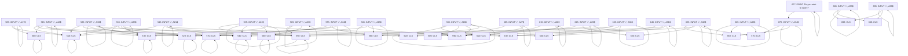

# MUD2.BAS - Act 1: Labyrinth Levels 2-3

```mermaid
flowchart TD
    L500["500: CLS"]
    L505["505: INPUT '>', A17$"]
    L510["510: CLS"]
    L515["515: INPUT '>', A18$"]
    L520["520: CLS"]
    L525["525: INPUT '>', A19$"]
    L530["530: CLS"]
    L535["535: INPUT '>', A20$"]
    L540["540: CLS"]
    L545["545: INPUT '>', A21$"]
    L550["550: CLS"]
    L555["555: INPUT '>', A22$"]
    L560["560: CLS"]
    L565["565: INPUT '>', A23$"]
    L570["570: CLS"]
    L575["575: INPUT '>', A24$"]
    L580["580: CLS"]
    L585["585: INPUT '>', A25$"]
    L590["590: CLS"]
    L595["595: INPUT '>', A26$"]
    L600["600: CLS"]
    L605["605: INPUT '>', A27$"]
    L610["610: CLS"]
    L615["615: INPUT '>', A28$"]
    L620["620: CLS"]
    L625["625: INPUT '>', A29$"]
    L630["630: CLS"]
    L635["635: INPUT '>', A30$"]
    L640["640: CLS"]
    L645["645: INPUT '>', A31$"]
    L650["650: CLS"]
    L655["655: INPUT '>', A32$"]
    L660["660: CLS"]
    L665["665: INPUT '>', A33$"]
    L670["670: CLS"]
    L675["675: INPUT '>', A34$"]
    L677["677: PRINT 'Do you wish to save <Y/N>?'"]
    L680["680: CLS"]
    L685["685: INPUT '>', A35$"]
    L690["690: CLS"]
    L695["695: INPUT '>', A36$"]

    L500 --> L500
    L505 --> L510
    L505 --> L500
    L505 --> L505
    L510 --> L510
    L515 --> L510
    L515 --> L520
    L515 --> L500
    L515 --> L540
    L515 --> L530
    L515 --> L515
    L520 --> L520
    L525 --> L510
    L525 --> L570
    L525 --> L525
    L525 --> L520
    L525 --> L620
    L525 --> L530
    L530 --> L530
    L535 --> L510
    L535 --> L535
    L535 --> L570
    L535 --> L520
    L535 --> L550
    L535 --> L530
    L540 --> L540
    L545 --> L510
    L545 --> L545
    L545 --> L550
    L545 --> L540
    L545 --> L630
    L550 --> L550
    L555 --> L550
    L555 --> L555
    L555 --> L540
    L555 --> L560
    L555 --> L530
    L555 --> L640
    L560 --> L560
    L565 --> L550
    L565 --> L565
    L565 --> L560
    L570 --> L570
    L575 --> L570
    L575 --> L520
    L575 --> L580
    L575 --> L530
    L575 --> L575
    L585 --> L585
    L585 --> L570
    L585 --> L590
    L585 --> L580
    L595 --> L610
    L595 --> L595
    L595 --> L600
    L595 --> L590
    L595 --> L580
    L605 --> L600
    L605 --> L605
    L605 --> L590
    L615 --> L610
    L615 --> L615
    L615 --> L590
    L625 --> L620
    L625 --> L650
    L625 --> L625
    L625 --> L520
    L635 --> L630
    L635 --> L540
    L635 --> L640
    L635 --> L635
    L645 --> L630
    L645 --> L550
    L645 --> L640
    L645 --> L645
    L655 --> L660
    L655 --> L650
    L655 --> L620
    L655 --> L655
    L655 --> L670
    L665 --> L665
    L665 --> L660
    L665 --> L670
    L675 --> L670
    L675 --> L675
    L675 --> L660
    L677 --> L675
    L677 --> L677
    L685 --> L690
    L685 --> L680
    L685 --> L685
    L695 --> L695
    L695 --> L690
    L695 --> L680
```

**Statistics:**
- Nodes (Line Labels): 41
- Edges (GOTO connections): 94
