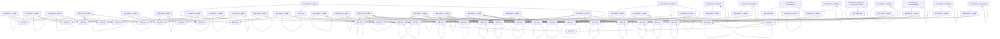

# MUD2.BAS - Act 1: Encampment Areas

```mermaid
flowchart TD
    L700["700: CLS"]
    L705["705: INPUT '>', A37$"]
    L710["710: CLS"]
    L715["715: INPUT '>', A38$"]
    L720["720: CLS"]
    L725["725: INPUT '>', A39$"]
    L730["730: CLS"]
    L735["735: INPUT '>', A40$"]
    L740["740: CLS"]
    L745["745: INPUT '>', A41$"]
    L750["750: CLS"]
    L755["755: INPUT '>', A42$"]
    L760["760: CLS"]
    L765["765: INPUT '>', A43$"]
    L770["770: CLS"]
    L775["775: INPUT '>', A44$"]
    L780["780: CLS"]
    L785["785: INPUT '>', A45$"]
    L790["790: CLS"]
    L795["795: INPUT '>', A46$"]
    L800["800: CLS"]
    L805["805: INPUT '>', A47$"]
    L810["810: CLS"]
    L813["813: INPUT '>', A48$"]
    L815["815: CLS"]
    L817["817: INPUT '>', A49$"]
    L818["818: INPUT '>', OGEM$"]
    L820["820: CLS"]
    L825["825: INPUT '>', A50$"]
    L830["830: CLS"]
    L835["835: INPUT '>', A51$"]
    L840["840: CLS"]
    L845["845: INPUT '>', A52$"]
    L850["850: CLS"]
    L855["855: INPUT '>', A53$"]
    L860["860: CLS"]
    L865["865: INPUT '>', A54$"]
    L870["870: CLS"]
    L875["875: INPUT '>', A55$"]
    L880["880: CLS"]
    L885["885: INPUT '>', A56$"]
    L890["890: CLS"]
    L895["895: INPUT '>', A57$"]
    L900["900: CLS"]
    L905["905: INPUT '>', A58$"]
    L907["907: INPUT '>', GGEM$"]
    L910["910: CLS"]
    L915["915: INPUT '>', A59$"]
    L917["917: INPUT '>', RGEM$"]
    L920["920: CLS"]
    L925["925: INPUT '>', A60$"]
    L930["930: CLS"]
    L935["935: INPUT '>', A61$"]
    L937["937: INPUT '>', BGEM$"]
    L940["940: CLS"]
    L945["945: INPUT '>', A62$"]
    L947["947: INPUT '>', JGEM$"]
    L950["950: CLS"]
    L955["955: INPUT '>', A63$"]
    L960["960: CLS"]
    L965["965: INPUT '>', A64$"]
    L967["967: INPUT '>', BLOODGEM$"]
    L970["970: CLS"]
    L975["975: INPUT '>', A65$"]
    L977["977: INPUT '>', WGEM$"]
    L980["980: CLS"]
    L985["985: INPUT '>', A66$"]
    L987["987: INPUT '>', BlueGEM$"]
    L990["990: CLS"]
    L995["995: INPUT '>', A67$"]
    L996["996: COLOR 5"]
    L997["997: INPUT '>', SirJacobA67$"]
    L998["998: PRINT 'Vampire> So do you wan't another "]
    L999["999: END SUB"]

    L705 --> L710
    L705 --> L700
    L705 --> L705
    L705 --> L770
    L715 --> L710
    L715 --> L720
    L715 --> L715
    L715 --> L700
    L725 --> L710
    L725 --> L730
    L725 --> L780
    L725 --> L725
    L725 --> L720
    L735 --> L720
    L735 --> L740
    L735 --> L735
    L735 --> L730
    L745 --> L730
    L745 --> L790
    L745 --> L740
    L745 --> L745
    L745 --> L750
    L755 --> L800
    L755 --> L740
    L755 --> L755
    L755 --> L750
    L765 --> L765
    L765 --> L760
    L775 --> L775
    L775 --> L770
    L775 --> L700
    L785 --> L785
    L785 --> L780
    L785 --> L720
    L795 --> L790
    L795 --> L740
    L795 --> L795
    L805 --> L805
    L805 --> L800
    L805 --> L810
    L805 --> L750
    L813 --> L800
    L813 --> L813
    L813 --> L810
    L813 --> L815
    L815 --> L815
    L817 --> L810
    L817 --> L820
    L818 --> L817
    L818 --> L818
    L818 --> L815
    L820 --> L820
    L825 --> L820
    L825 --> L825
    L825 --> L830
    L825 --> L815
    L830 --> L830
    L835 --> L830
    L835 --> L850
    L835 --> L820
    L835 --> L835
    L835 --> L840
    L840 --> L840
    L845 --> L880
    L845 --> L830
    L845 --> L850
    L845 --> L950
    L845 --> L845
    L845 --> L840
    L845 --> L970
    L845 --> L870
    L850 --> L850
    L855 --> L890
    L855 --> L880
    L855 --> L830
    L855 --> L850
    L855 --> L855
    L855 --> L840
    L855 --> L980
    L855 --> L860
    L860 --> L860
    L865 --> L920
    L865 --> L890
    L865 --> L880
    L865 --> L850
    L865 --> L910
    L865 --> L865
    L865 --> L860
    L865 --> L870
    L870 --> L870
    L875 --> L920
    L875 --> L880
    L875 --> L950
    L875 --> L875
    L875 --> L940
    L875 --> L840
    L875 --> L860
    L875 --> L870
    L880 --> L880
    L880 --> L990
    L885 --> L885
    L885 --> L850
    L885 --> L880
    L885 --> L840
    L885 --> L860
    L885 --> L870
    L890 --> L890
    L895 --> L890
    L895 --> L850
    L895 --> L900
    L895 --> L895
    L895 --> L860
    L900 --> L900
    L905 --> L890
    L907 --> L900
    L907 --> L905
    L907 --> L907
    L910 --> L910
    L915 --> L860
    L917 --> L915
    L917 --> L910
    L917 --> L917
    L920 --> L920
    L925 --> L920
    L925 --> L930
    L925 --> L925
    L925 --> L860
    L925 --> L870
    L930 --> L930
    L935 --> L920
    L937 --> L930
    L937 --> L935
    L937 --> L937
    L940 --> L940
    L945 --> L870
    L947 --> L947
    L947 --> L945
    L947 --> L940
    L950 --> L950
    L955 --> L955
    L955 --> L950
    L955 --> L960
    L955 --> L840
    L955 --> L870
    L960 --> L960
    L965 --> L950
    L967 --> L960
    L967 --> L965
    L967 --> L967
    L970 --> L970
    L975 --> L840
    L977 --> L970
    L977 --> L975
    L977 --> L977
    L980 --> L980
    L985 --> L850
    L987 --> L985
    L987 --> L980
    L987 --> L987
    L995 --> L995
    L997 --> L996
    L997 --> L990
    L997 --> L935
    L997 --> L995
    L998 --> L998
    L998 --> L999
```

**Statistics:**
- Nodes (Line Labels): 74
- Edges (GOTO connections): 166
