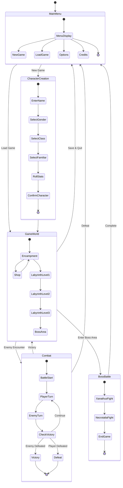

# MUD2.BAS - High-Level State Diagram

This is a simplified state diagram showing major game states and their relationships.

**High-Level Game Flow:**
1. Main Menu - Entry point
2. Character Creation - Set up player
3. Game World - Exploration and navigation
4. Combat - Battle encounters
5. Boss Battle - Final challenges
